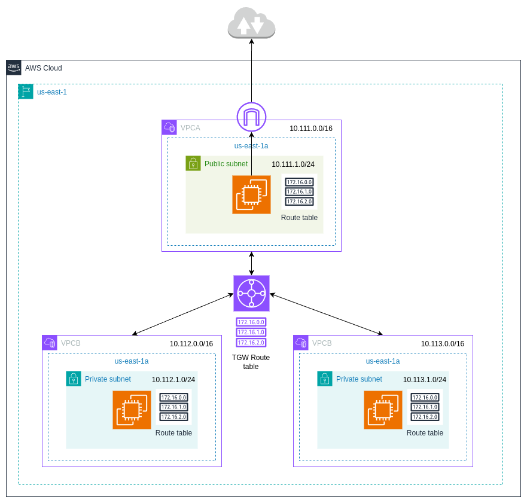
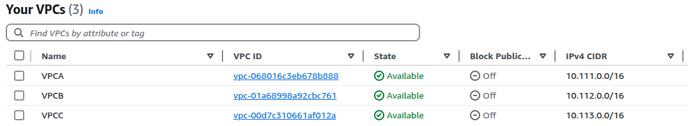
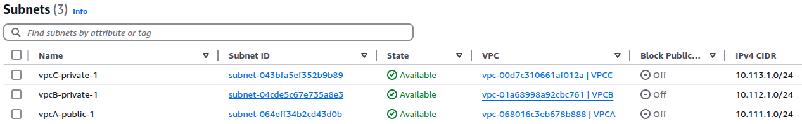
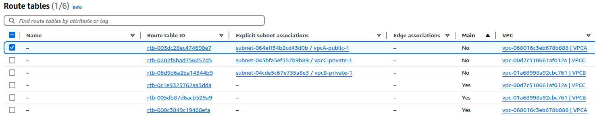
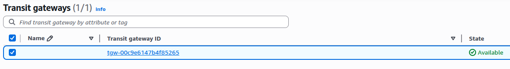
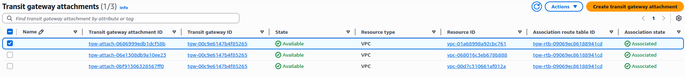
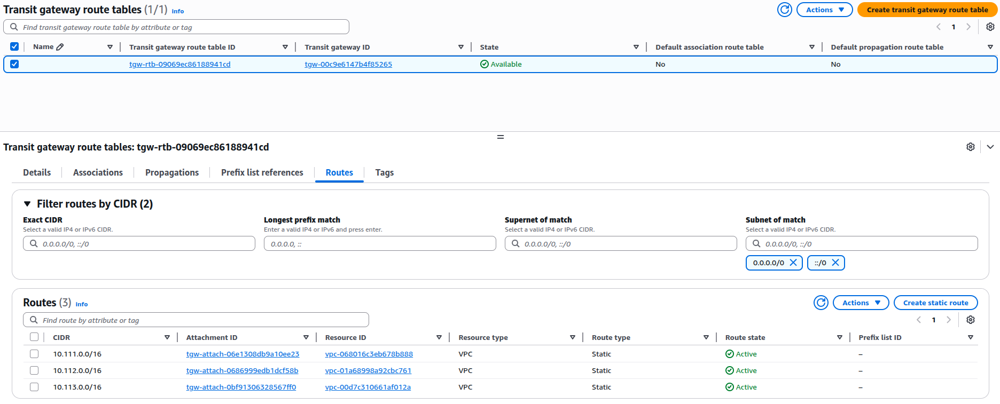
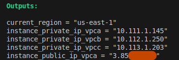
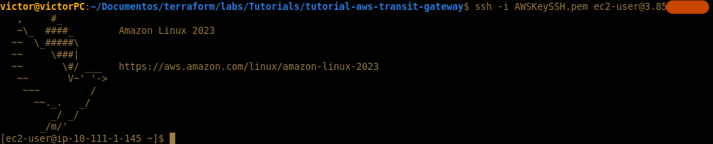
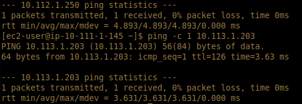

# Overview

Connecting multiple VPCs is a common networking requirement in AWS. We are going to address this by using AWS Transit Gateway, which allows us to establish a central point of connectivity and being highly scalable. 

The architecture will consist of three VPCs interconnected with a Transit Gateway. VPCA will have a public subnet, while VPCB and VPCC will have one private subnet each respectively. 



## VPC and Subnet Configuration

| VPC Name | VPC CIDR Block | Subnet Name    | Subnet CIDR Block |
|----------|----------------|----------------|--------------------|
| VPCA     | 10.111.0.0/16    | vpcA-public-1 | 10.111.1.0/24        |
| VPCB     | 10.112.0.0/16    | vpcB-private-1 | 10.112.1.0/24        |
| VPCC     | 10.113.0.0/16    | vpcC-private-1 | 10.113.1.0/24        |

## Route Table Configuration

Since the idea is to interconnect all VPCs, we need to create the routes to reach them. VPCA has a default route which targets the IGW and two routes for VPCB and VPCC targeting the Transit Gateway. Meanwhile VPCB and VPCC have routes to the other two VPCs through the TGW. 

| VPC Name | Route Table         | Destination CIDR | Target (Next Hop)         | Notes                        |
|----------|---------------------|------------------|----------------------------|------------------------------|
| VPCA     | public_rtb_vpca     | 0.0.0.0/0        | Internet Gateway (`igw`)   | Internet access              |
| VPCA     | public_rtb_vpca     | 10.112.0.0/16    | Transit Gateway (`tgw`)    | Route to VPCB                |
| VPCA     | public_rtb_vpca     | 10.113.0.0/16    | Transit Gateway (`tgw`)    | Route to VPCC                |
| VPCB     | public_rtb_vpcb     | 10.111.0.0/16    | Transit Gateway (`tgw`)    | Route to VPCA                |
| VPCB     | public_rtb_vpcb     | 10.113.0.0/16    | Transit Gateway (`tgw`)    | Route to VPCC                |
| VPCC     | public_rtb_vpcc     | 10.111.0.0/16    | Transit Gateway (`tgw`)    | Route to VPCA                |
| VPCC     | public_rtb_vpcc     | 10.112.0.0/16    | Transit Gateway (`tgw`)    | Route to VPCB                |

## Set up the Providers
 
```
terraform {
  required_version = "~> 1.10.2"
  required_providers {
    aws = {
      source  = "hashicorp/aws"
      version = "5.83.1"
    }
    local = {
      source  = "hashicorp/local"
      version = "2.5.2"
    }
    tls = {
      source  = "hashicorp/tls"
      version = "4.0.6"
    }
  }
}


#Configuring AWS Provider
provider "aws" {
 region = "us-east-1"
}
```

## Create the base infrastructure

The following code will create the base of our infrastructure (VPCs, Subnets, Internet Gateway, Key pairs, and Route tables). We are not going to dig in much in it since our main focus will the setting up the Transit Gateway. For a more detailed explanation of these resources go to my other repo [🔗 AWS Load Balancer with DNS Tutorial](https://github.com/victorhponcec/tutorial-aws-load-balancer-dns)


```
#VPCA
resource "aws_vpc" "vpca" {
  cidr_block = "10.111.0.0/16"
}
#VPCB
resource "aws_vpc" "vpcb" {
  cidr_block = "10.112.0.0/16"
}
#VPCC 
resource "aws_vpc" "vpcc" {
  cidr_block = "10.113.0.0/16"
}

#Subnet Public
resource "aws_subnet" "public_subnet_vpca" {
  vpc_id            = aws_vpc.vpca.id
  cidr_block        = "10.111.1.0/24"
  availability_zone = "us-east-1a"

}
resource "aws_subnet" "private_subnet_vpcb" {
  vpc_id            = aws_vpc.vpcb.id
  cidr_block        = "10.112.1.0/24"
  availability_zone = "us-east-1a"

}
resource "aws_subnet" "private_subnet_vpcc" {
  vpc_id            = aws_vpc.vpcc.id
  cidr_block        = "10.113.1.0/24"
  availability_zone = "us-east-1a"

}

#Internet Gateway
resource "aws_internet_gateway" "igw" {
  vpc_id = aws_vpc.vpca.id
}

#Route Tables
#Public Route table - VPCA
resource "aws_route_table" "public_rtb_vpca" {
  vpc_id = aws_vpc.vpca.id
  route {
    cidr_block = "0.0.0.0/0"
    gateway_id = aws_internet_gateway.igw.id
  }
  route {
    cidr_block = "10.112.0.0/16" //route to VPCB through TGW
    gateway_id = aws_ec2_transit_gateway.tgw.id
  }
  route {
    cidr_block = "10.113.0.0/16" //route to VPCC through TGW
    gateway_id = aws_ec2_transit_gateway.tgw.id
  }
}
#Public Route table - VPCB
resource "aws_route_table" "public_rtb_vpcb" {
  vpc_id = aws_vpc.vpcb.id
  route {
    cidr_block = "10.111.0.0/16" //route to VPCA through TGW
    gateway_id = aws_ec2_transit_gateway.tgw.id
  }
  route {
    cidr_block = "10.113.0.0/16" //route to VPCC through TGW
    gateway_id = aws_ec2_transit_gateway.tgw.id
  }
}
#Public Route table - VPCC
resource "aws_route_table" "public_rtb_vpcc" {
  vpc_id = aws_vpc.vpcc.id
  route {
    cidr_block = "10.111.0.0/16" //route to VPCA through TGW
    gateway_id = aws_ec2_transit_gateway.tgw.id
  }
  route {
    cidr_block = "10.112.0.0/16" //route to VPCB through TGW
    gateway_id = aws_ec2_transit_gateway.tgw.id
  }
}

#Create route table associations
#Associate public Subnet to public route table - VPCA
resource "aws_route_table_association" "public_vpca" {
  subnet_id      = aws_subnet.public_subnet_vpca.id
  route_table_id = aws_route_table.public_rtb_vpca.id
}
#Associate private Subnet to public route table - VPCB
resource "aws_route_table_association" "public_vpcb" {
  subnet_id      = aws_subnet.private_subnet_vpcb.id
  route_table_id = aws_route_table.public_rtb_vpcb.id
}
#Associate private Subnet to public route table - VPCB
resource "aws_route_table_association" "public_vpcc" {
  subnet_id      = aws_subnet.private_subnet_vpcc.id
  route_table_id = aws_route_table.public_rtb_vpcc.id
}

#SSH Config
#Create PEM File
resource "tls_private_key" "pkey" {
  algorithm = "RSA"
  rsa_bits  = 4096
}

resource "local_file" "private_key_pem" {
  content         = tls_private_key.pkey.private_key_pem
  filename        = "AWSKeySSH.pem"
  file_permission = "0400" #NOT TESTED
}

#AWS SSH EC2 Key Pair | uses tls_private_key to generate public key
resource "aws_key_pair" "ec2_key" {
  key_name   = "AWSKeySSH"
  public_key = tls_private_key.pkey.public_key_openssh

  lifecycle {
    ignore_changes = [key_name] #to ensure it creates a different pair of keys each time
  }
}
```

## Security Groups

Since there are three VPCs we need to create three security groups (ssh_vpc*) to allow ingress and egress traffic to and from our EC2 instances. This security group will allow SSH/ICMP ingress traffic and a default route to allow all egress traffic for testing purposes.

```
#Security Group - EC2
#Security group to allow SSH - VPCA
resource "aws_security_group" "ssh_vpca" {
  name        = "ssh_vpca"
  description = "allow SSH (for EC2 instance)"
  vpc_id      = aws_vpc.vpca.id
}

#Ingress rule for SSH
resource "aws_vpc_security_group_ingress_rule" "allow_ssh_vpca" {
  security_group_id = aws_security_group.ssh_vpca.id
  cidr_ipv4         = "0.0.0.0/0"
  from_port         = 22
  to_port           = 22
  ip_protocol       = "tcp"
}
resource "aws_vpc_security_group_ingress_rule" "allow_icmp_vpca" {
  security_group_id = aws_security_group.ssh_vpca.id
  cidr_ipv4         = "0.0.0.0/0"
  from_port         = -1
  to_port           = -1
  ip_protocol       = "icmp"
}
#Egress rule for SSH
resource "aws_vpc_security_group_egress_rule" "egress_ssh_all_vpca" {
  security_group_id = aws_security_group.ssh_vpca.id
  cidr_ipv4         = "0.0.0.0/0"
  ip_protocol       = "-1"
}
#Security group to allow SSH - VPCB
resource "aws_security_group" "ssh_vpcb" {
  name        = "ssh_vpcb"
  description = "allow SSH (for EC2 instance)"
  vpc_id      = aws_vpc.vpcb.id
}

#Ingress rule for SSH
resource "aws_vpc_security_group_ingress_rule" "allow_ssh_vpcb" {
  security_group_id = aws_security_group.ssh_vpcb.id
  cidr_ipv4         = "0.0.0.0/0"
  from_port         = 22
  to_port           = 22
  ip_protocol       = "tcp"
}
resource "aws_vpc_security_group_ingress_rule" "allow_icmp_vpcb" {
  security_group_id = aws_security_group.ssh_vpcb.id
  cidr_ipv4         = "0.0.0.0/0"
  from_port         = -1
  to_port           = -1
  ip_protocol       = "icmp"
}
#Egress rule for SSH
resource "aws_vpc_security_group_egress_rule" "egress_ssh_all_vpcb" {
  security_group_id = aws_security_group.ssh_vpcb.id
  cidr_ipv4         = "0.0.0.0/0"
  ip_protocol       = "-1"
}
#Security group to allow SSH - VPCC
resource "aws_security_group" "ssh_vpcc" {
  name        = "ssh_vpcc"
  description = "allow SSH (for EC2 instance)"
  vpc_id      = aws_vpc.vpcc.id
}

#Ingress rule for SSH
resource "aws_vpc_security_group_ingress_rule" "allow_ssh_vpcc" {
  security_group_id = aws_security_group.ssh_vpcc.id
  cidr_ipv4         = "0.0.0.0/0"
  from_port         = 22
  to_port           = 22
  ip_protocol       = "tcp"
}
resource "aws_vpc_security_group_ingress_rule" "allow_icmp_vpcc" {
  security_group_id = aws_security_group.ssh_vpcc.id
  cidr_ipv4         = "0.0.0.0/0"
  from_port         = -1
  to_port           = -1
  ip_protocol       = "icmp"
}
#Egress rule for SSH
resource "aws_vpc_security_group_egress_rule" "egress_ssh_all_vpcc" {
  security_group_id = aws_security_group.ssh_vpcc.id
  cidr_ipv4         = "0.0.0.0/0"
  ip_protocol       = "-1"
}
```

## EC2 Instances

We can now create and place our EC2 instances in their respective subnets. We associate them with the security groups we just created. 

```
#EC2 Instances - VPCA
resource "aws_instance" "amazon_linux_vpca" {
  ami                         = "ami-05576a079321f21f8"
  instance_type               = "t2.micro"
  security_groups             = [aws_security_group.ssh_vpca.id]
  subnet_id                   = aws_subnet.public_subnet_vpca.id
  associate_public_ip_address = true
  key_name                    = aws_key_pair.ec2_key.key_name
}
#EC2 Instances - VPCB
resource "aws_instance" "amazon_linux_vpcb" {
  ami                         = "ami-05576a079321f21f8"
  instance_type               = "t2.micro"
  security_groups             = [aws_security_group.ssh_vpcb.id]
  subnet_id                   = aws_subnet.private_subnet_vpcb.id
}
#EC2 Instances - VPCC
resource "aws_instance" "amazon_linux_vpcc" {
  ami                         = "ami-05576a079321f21f8"
  instance_type               = "t2.micro"
  security_groups             = [aws_security_group.ssh_vpcc.id]
  subnet_id                   = aws_subnet.private_subnet_vpcc.id
}
```

## Transit Gateway

Now we can focus on the main goal of this tutorial, setting up a transit gateway and configuring it to connect our VPCs. 

First we create our TGW. We are going to disable route table association and propagation to have full control of the routing policy: 

```
#Transit Gateway
resource "aws_ec2_transit_gateway" "tgw" {
  description                     = "main-tgw"
  default_route_table_association = "disable"
  default_route_table_propagation = "disable"
}
```

Create one Transit Gateway attachment for each subnet in VPCA, VPCB and VPCC:

```
#Transit Gateway Attachment - Subnets VPCA
resource "aws_ec2_transit_gateway_vpc_attachment" "subnets_vpca" {
  subnet_ids         = [aws_subnet.public_subnet_vpca.id]
  transit_gateway_id = aws_ec2_transit_gateway.tgw.id
  vpc_id             = aws_vpc.vpca.id
}

#Transit Gateway Attachment - Subnets VPCB
resource "aws_ec2_transit_gateway_vpc_attachment" "subnets_vpcb" {
  subnet_ids         = [aws_subnet.private_subnet_vpcb.id]
  transit_gateway_id = aws_ec2_transit_gateway.tgw.id
  vpc_id             = aws_vpc.vpcb.id
}

#Transit Gateway Attachment - Subnets VPCC
resource "aws_ec2_transit_gateway_vpc_attachment" "subnets_vpcc" {
  subnet_ids         = [aws_subnet.private_subnet_vpcc.id]
  transit_gateway_id = aws_ec2_transit_gateway.tgw.id
  vpc_id             = aws_vpc.vpcc.id
}
```

The final piece of the puzzle is creating a Transit Gateway route table (tgw_route_table). We need to create one route for each subnet (tgw_route_to_vpc*). The final step is associating each subnet attachment (association_vpc*) with our route table:

```
#Transit Gateway Route Table
resource "aws_ec2_transit_gateway_route_table" "tgw_route_table" {
  transit_gateway_id = aws_ec2_transit_gateway.tgw.id
}

#Transit Gateway Routes - VPCA
resource "aws_ec2_transit_gateway_route" "tgw_route_to_vpca" {
  destination_cidr_block         = "10.111.0.0/16"
  transit_gateway_attachment_id  = aws_ec2_transit_gateway_vpc_attachment.subnets_vpca.id
  transit_gateway_route_table_id = aws_ec2_transit_gateway_route_table.tgw_route_table.id
}

#Transit Gateway Routes - VPCB
resource "aws_ec2_transit_gateway_route" "tgw_route_to_vpcb" {
  destination_cidr_block         = "10.112.0.0/16"
  transit_gateway_attachment_id  = aws_ec2_transit_gateway_vpc_attachment.subnets_vpcb.id
  transit_gateway_route_table_id = aws_ec2_transit_gateway_route_table.tgw_route_table.id
}

#Transit Gateway Routes - VPCC
resource "aws_ec2_transit_gateway_route" "tgw_route_to_vpcc" {
  destination_cidr_block         = "10.113.0.0/16"
  transit_gateway_attachment_id  = aws_ec2_transit_gateway_vpc_attachment.subnets_vpcc.id
  transit_gateway_route_table_id = aws_ec2_transit_gateway_route_table.tgw_route_table.id
}

#Transit Gateway Association - VPCA
resource "aws_ec2_transit_gateway_route_table_association" "association_vpca" {
  transit_gateway_attachment_id  = aws_ec2_transit_gateway_vpc_attachment.subnets_vpca.id
  transit_gateway_route_table_id = aws_ec2_transit_gateway_route_table.tgw_route_table.id
}
#Transit Gateway Association - VPCB
resource "aws_ec2_transit_gateway_route_table_association" "association_vpcb" {
  transit_gateway_attachment_id  = aws_ec2_transit_gateway_vpc_attachment.subnets_vpcb.id
  transit_gateway_route_table_id = aws_ec2_transit_gateway_route_table.tgw_route_table.id
}
#Transit Gateway Association - VPCC
resource "aws_ec2_transit_gateway_route_table_association" "association_vpcc" {
  transit_gateway_attachment_id  = aws_ec2_transit_gateway_vpc_attachment.subnets_vpcc.id
  transit_gateway_route_table_id = aws_ec2_transit_gateway_route_table.tgw_route_table.id
}
```

## Outputs

Create the following outputs for testing

```
data "aws_region" "current" {}

output "current_region" {
  value = data.aws_region.current.name
}

output "instance_public_ip_vpca" {
  value = aws_instance.amazon_linux_vpca.public_ip
}
output "instance_private_ip_vpca" {
  value = aws_instance.amazon_linux_vpca.private_ip
}

output "instance_private_ip_vpcb" {
  value = aws_instance.amazon_linux_vpcb.private_ip
}

output "instance_private_ip_vpcc" {
  value = aws_instance.amazon_linux_vpcc.private_ip
}
```

## Create the infrastructure in AWS

```
terraform init
terraform validate
terraform plan
terraform apply
```

## Testing

You can go to the AWS Console > VPC, and verify that all resources have been created.

### VPCs:

### Subnets:

### Route Tables:

### Transit Gateway:

### TGW Attachments:

### TGW Route Tables:


When you ran apply, there were outputs showing the IPs of our resources. Take the public IP from our EC2 instance in VPCA and ssh into it with the command "ssh -i AWSKeySSH.pem ec2-user@<PUBLIC_IP>. Make sure to be placed in the main directory where our pem file is. 





To conclude, from our EC2 intance in VPCA, we should be able to ping and reach the instances in VPCB and VPCC:

